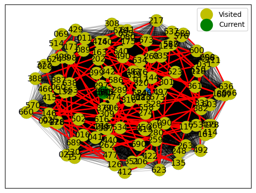
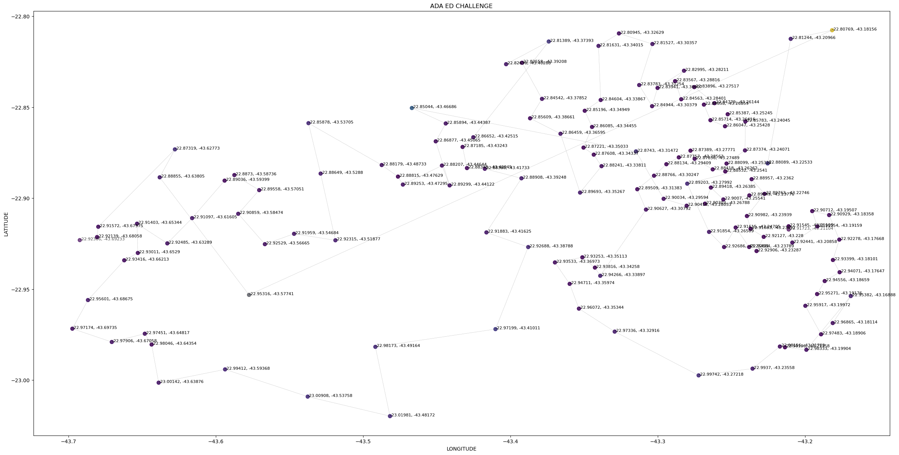

   You work at a data consultancy firm that has been hired to manage the distribution of educational materials to schools in the city of Rio de Janeiro. Your mission is to process the data according to the standard norms set by the client and determine the most efficient route for a truck to deliver the educational materials, optimizing its journey.

    For this project, you received three files:

    schools.csv: contains the data of the schools. Download the dataset here.
    subprefectures.csv: contains data on which neighborhoods belong to each subprefecture. Download the dataset here.
    educational_material.csv: provides the quantity of educational materials that each school should receive. Download the dataset here.
    As a final deliverable, you should provide:

    A CSV file in which the rows are already sorted according to the route to be followed. Additionally, the data should follow the specified standard below and contain the following columns: school id, school name, school type (EM, CIEP, or college), delivery address, number, neighborhood, subprefecture, latitude, longitude, and quantity of educational material to be delivered. The school's address should be in a column separate from the number.
    A CSV file with the total quantity of school materials per subprefecture, so the costs per subprefecture can be accounted for.
    Regarding data standards, consider:

    Column names in snake_case.
    Strings should not contain accents.
    All strings should be in uppercase.
    Standardization of street names without abbreviations (e.g., "R." should read as "Street").
    Latitude and longitude should only contain 5 decimal places.
    All school IDs should be strings with 3 characters (e.g., '024').
    Challenge: Deliver a plot illustrating the best route you've determined.

# My idea for the challenge

----
#### About the Challenge:

-- IMPORTANT: THE PROBLEM IS EASY TO SOLVE. BUT I TRIED AN APPROACH FOR THE CASE THAT THERE ISN'T A EASY WAY TO SOLVE AS WE HAVE WITH LONGITUDE IN ORDER TO LEARN. MY SOLUTION GOT 96% APPROXIMATION. THIS IS THE FIRST TIME TRYING THIS KIND OF PROBLEM -- 

- I make a consideration of a symmetric distance matrix, with N^2 calculations, and store it (we could use divide and conquer, assuming a larger dataset, while maintaining at least reasonable handling).

- I find the pair with the smallest distance to ensure the initialization of the smallest pair of points (MIN value).

- Now, I search for the MIN again for each pair of values and find the starting point, such as coord[Y, X], to create a new coordinate coord_new[(Y or X), Z], always removing it from the list if I have already found it previously to avoid recalculations in larger orders.

- The result is a list of values containing all the pairs, stored in temporary memory.

- I will use the ID data from temporary memory, with the logic applied earlier, to organize the schools in the order to be traversed.

#### Considerations about "intentional" data cleaning "issues":

- I will not validate the data type in the columns before processing.
- I will perform all cleaning grouped by the type of checklist usage.
- When not applicable, I will perform treatments for checklists with different approaches.
- Some treatments are duplicated.

